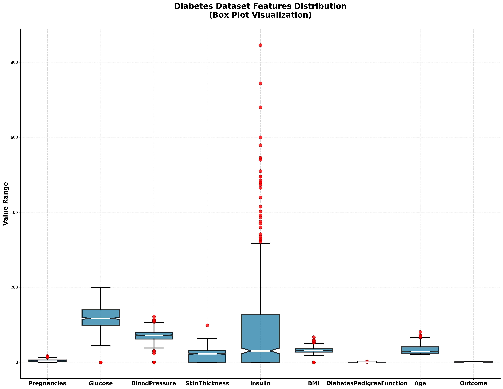
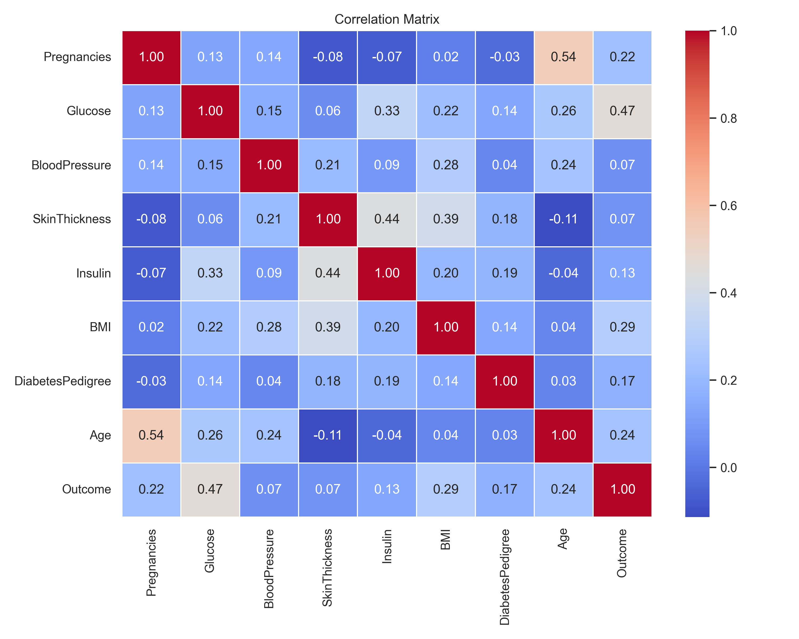

# تحلیل بصری داده‌ها و استراتژی‌های پیش‌پردازش
**پروژه تشخیص دیابت با یادگیری ماشین**

---

## ۱. تحلیل توزیع داده‌ها (Histograms)

  

### 🔍 مشاهده (Observation)
*   در نمودارهای `Glucose`، `BloodPressure`، `SkinThickness`، `Insulin` و `BMI`، یک ستون غیرطبیعی روی عدد **صفر** وجود دارد.

### 💡 نتیجه‌گیری (Insight)
*   از نظر بیولوژیکی، فشار خون یا ضخامت پوست انسان نمی‌تواند صفر باشد.
*   این صفرها نشان‌دهنده **داده‌های گم‌شده (Missing Values)** هستند که با عدد ۰ پر شده‌اند.

### 🛠 راهکار در کد (Solution)
*   **Imputation:** شناسایی صفرها در این ستون‌ها و تبدیل آن‌ها به `NaN`.
*   سپس پر کردن جاهای خالی با روش‌های آماری (در ادامه توضیح داده می‌شود).

---

## ۲. تحلیل داده‌های پرت (Box Plot)

  

### 🔍 مشاهده (Observation)
1.  **داده‌های پرت (Outliers):** در ستون `Insulin` نقاط قرمز زیادی در مقادیر بالا (تا ۸۰۰) دیده می‌شود.
2.  **تفاوت مقیاس:** دامنه اعداد انسولین (۰ تا ۸۰۰) با ویژگی‌هایی مثل `DiabetesPedigree` (۰ تا ۲.۵) بسیار متفاوت است.

### 💡 نتیجه‌گیری (Insight)
1.  وجود داده‌های پرت باعث می‌شود **میانگین (Mean)** معیار مناسبی برای پر کردن داده‌های خالی نباشد (میانگین به سمت اعداد پرت کشیده می‌شود).
2. تفاوت مقیاس باعث انحراف مدل‌های مبتنی بر فاصله (مثل KNN) می‌شود.

### 🛠 راهکار در کد (Solution)
1.  **Median Imputation:** استفاده از **میانه** به جای میانگین برای پر کردن صفرهای مرحله قبل (چون میانه نسبت به داده پرت مقاوم است).
2. **Normalization:** انجام نرمال‌سازی (Z-Score) برای هم‌وزن کردن تمام ویژگی‌ها.

---

## ۳. تحلیل همبستگی (Correlation Matrix)

  

### 🔍 مشاهده (Observation)
*   ویژگی `Glucose` (قند خون) با **۰.۴۷** بیشترین ارتباط را با بیماری دارد.
*   ویژگی‌های `BloodPressure` و `SkinThickness` با ضریب **۰.۰۷** کمترین ارتباط را دارند.

### 💡 نتیجه‌گیری (Insight)
*   ویژگی‌هایی که همبستگی نزدیک به صفر دارند، اطلاعات مفیدی به مدل نمی‌دهند و فقط نقش **نویز** را بازی می‌کنند که باعث کاهش دقت و سرعت می‌شود.

### 🛠 راهکار در کد (Solution)
*   **Feature Selection:** حذف ستون‌های `BloodPressure` و `SkinThickness` از دیتاست قبل از آموزش مدل، جهت سبک‌سازی و افزایش تمرکز مدل بر شاخص‌های کلیدی.

---

## ✅ خلاصه استراتژی نهایی پروژه

| چالش شناسایی شده | منبع تشخیص | راهکار اعمال شده |
| :--- | :--- | :--- |
| **داده‌های گم‌شده (صفرها)** | نمودار هیستوگرام | جایگزینی (Imputation) |
| **داده‌های پرت (Outliers)** | نمودار Box Plot | استفاده از **میانه** به جای میانگین |
| **تفاوت مقیاس اعداد** | نمودار Box Plot | نرمال‌سازی (Normalization) |
| **ویژگی‌های بی‌ارزش (نویز)** | ماتریس همبستگی | حذف ویژگی (Feature Selection) |